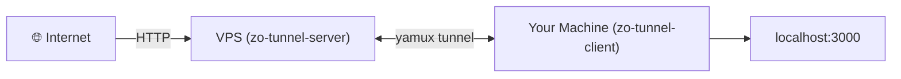
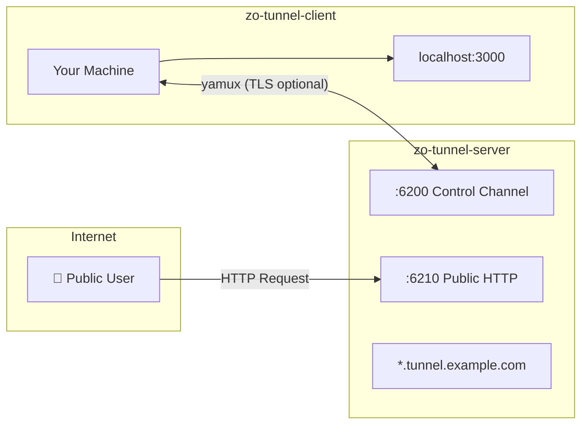
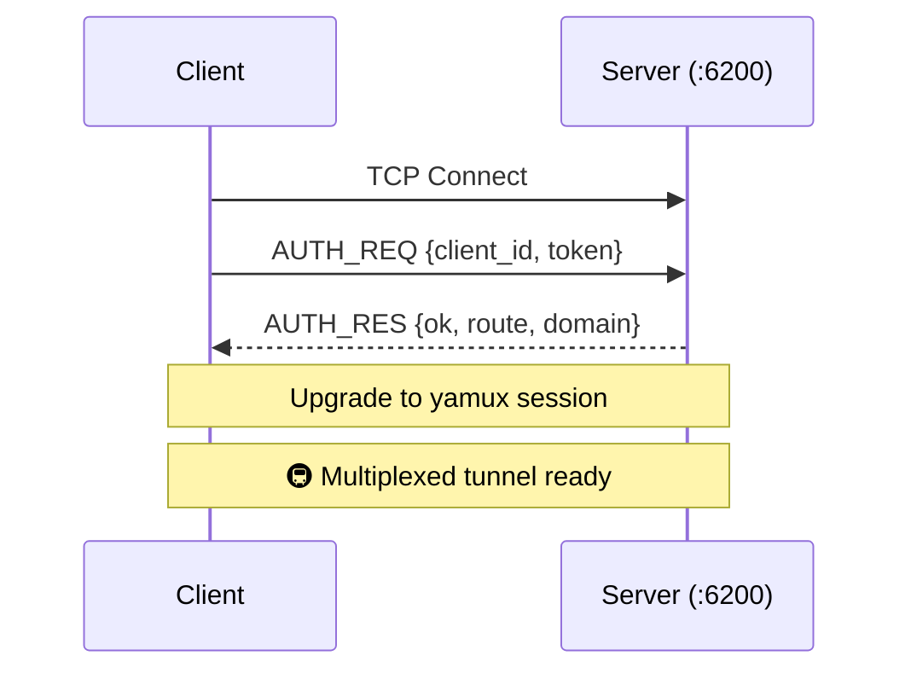
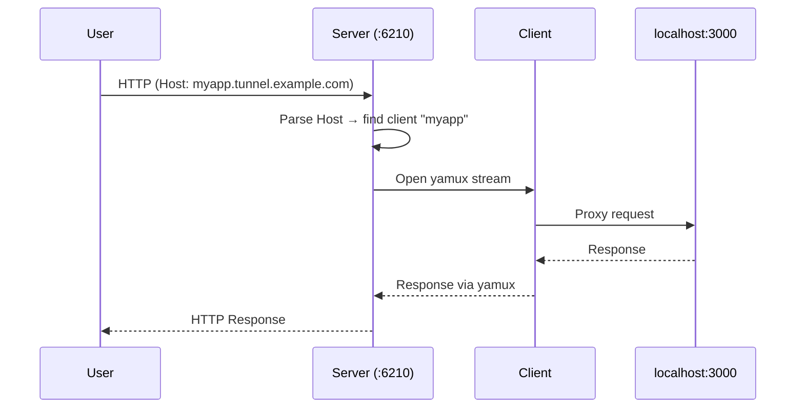

# 🚀 Zo Tunnel

**Self-hosted ngrok alternative — expose any local service to the internet through your own VPS.**

[](https://www.rust-lang.org/)
[](LICENSE)



---

## ✨ Features

- 🌐 **Subdomain routing** — `myapp.tunnel.example.com` for each client
- 🔒 **Token-based auth** — configurable list of valid tokens
- 💾 **Login once, connect forever** — save credentials locally after first auth
- ⚡ **Yamux multiplexing** — multiple streams over a single TCP connection
- 📊 **Live dashboard** — real-time web UI at `dashboard.<domain>`
- 🔐 **TLS control channel** — optional TLS for client ↔ server communication
- 🛡️ **Rate limiting** — per-client request throttling
- 🔄 **Auto-reconnect** — exponential backoff (1s → 30s)
- 📦 **Single static binary** — ~3.6MB server, ~2.9MB client
- 🔧 **CLI setup** — one command to configure, one to start

---

## 📐 Architecture



| Port | Role |
|---|---|
| `:6200` | Control channel — client ↔ server yamux (optional TLS) |
| `:6210` | Public HTTP — subdomain routing + dashboard |

Each client is accessible at `<client_id>.<domain>`, dashboard at `dashboard.<domain>`.

---

## 🚀 Quick Start

### 1. Install server on VPS

```bash
# Download pre-built binary
curl -sSL https://raw.githubusercontent.com/Zobite/zo-tunnel/main/scripts/install.sh | sudo bash -s server

# Setup (domain is required)
zo-tunnel-server setup --domain tunnel.example.com

# Start
zo-tunnel-server start
```

Setup prints your **token** and **client connect command**.

### 2. DNS setup

Add a wildcard A record pointing to your VPS:

```
*.tunnel.example.com  →  YOUR_VPS_IP
```

### 3. Install client on local machine

```bash
curl -sSL https://raw.githubusercontent.com/Zobite/zo-tunnel/main/scripts/install.sh | bash -s client
```

### 4. Login (one time only)

Save your server credentials so you never have to type them again:

```bash
zo-tunnel-client login --server YOUR_VPS_IP:6200 --token YOUR_TOKEN
```

```
✅ Credentials saved to ~/.zo-tunnel/credentials.yaml

  Server: YOUR_VPS_IP:6200
  Token:  YOUR_****
  TLS:    disabled

  You can now connect without --server and --token:
    zo-tunnel-client connect --local localhost:3000 --id my-app
```

### 5. Connect

```bash
zo-tunnel-client connect --local localhost:3000 --id my-api
```

```
✅ Authenticated!
┌──────────────────────────────────────────┐
│  🌐 Tunnel: http://my-api.tunnel.example.com
└──────────────────────────────────────────┘
🚇 Tunnel active — waiting for connections...
```

Access at: `http://my-api.tunnel.example.com` 🎉

### Multi-client example

```bash
# Login once
zo-tunnel-client login --server vps:6200 --token secret

# Web frontend
zo-tunnel-client connect --id webapp --local localhost:3000
# → http://webapp.tunnel.example.com

# API server
zo-tunnel-client connect --id api --local localhost:8080
# → http://api.tunnel.example.com

# Ollama
zo-tunnel-client connect --id ollama --local localhost:11434
# → http://ollama.tunnel.example.com
```

---

## 🔒 Traefik + SSL (Recommended)

For production with HTTPS, put [Traefik](https://traefik.io/) in front of zo-tunnel's public port.

Zo Tunnel tự động tạo/xóa Traefik config file cho mỗi client khi connect/disconnect. Traefik detect thay đổi và provision SSL cert cho từng subdomain tự động (HTTP-01 challenge — **không cần DNS API**).

```bash
# Setup server với Traefik integration
zo-tunnel-server setup --domain tunnel.example.com --traefik-dir /etc/traefik/dynamic
```

**Traefik static config (`traefik.yml`):**

```yaml
entryPoints:
  web:
    address: ":80"
    http:
      redirections:
        entryPoint:
          to: websecure
          scheme: https
  websecure:
    address: ":443"

certificatesResolvers:
  letsencrypt:
    acme:
      email: "your-email@example.com"
      storage: "/letsencrypt/acme.json"
      httpChallenge:
        entryPoint: web

providers:
  file:
    directory: "/etc/traefik/dynamic"
    watch: true
```

Xong! Khi client connect:

```
Client connect --id my-api
  → Server tạo /etc/traefik/dynamic/zo-my-api.yml
  → Traefik detect → provision cert → https://my-api.tunnel.example.com ✅

Client disconnect
  → Server xóa /etc/traefik/dynamic/zo-my-api.yml
  → Traefik remove route
```

> **DNS setup:** Cần A record cho mỗi subdomain trỏ về VPS (hoặc wildcard `*.tunnel.example.com → VPS_IP`).

---

## 📖 CLI Reference

### Server

#### `zo-tunnel-server setup`

| Flag | Default | Description |
|---|---|---|
| `--domain` | *(required)* | Base domain for subdomain routing |
| `--control-port` | `6200` | Client control channel port |
| `--public-port` | `6210` | Public HTTP port |
| `--token` | *(auto-generated)* | Client auth token |
| `--dashboard-token` | *(auto-generated)* | Dashboard admin token |
| `--tls-cert` | — | TLS certificate file (PEM) |
| `--tls-key` | — | TLS private key file (PEM) |
| `--force` | — | Overwrite existing config |

#### `zo-tunnel-server start`

Loads saved config and starts the server. No additional flags.

#### `zo-tunnel-server status`

Displays current configuration summary and token info.

#### `zo-tunnel-server upgrade`

Self-upgrade to the latest version from GitHub releases.

```bash
zo-tunnel-server upgrade
```

- Checks GitHub for the latest release
- Compares with current version — skips if already up-to-date
- Downloads the correct binary for your OS/arch
- Replaces the binary in `/usr/local/bin/` (uses `sudo` if needed)

> **Note:** Restart the service after upgrading: `sudo systemctl restart zo-tunnel`

#### `zo-tunnel-server uninstall`

Remove the server binary, systemd service, and config.

```bash
zo-tunnel-server uninstall           # interactive confirmation
zo-tunnel-server uninstall --yes     # skip confirmation
zo-tunnel-server uninstall --keep-config  # preserve /etc/zo-tunnel/
```

| Flag | Description |
|---|---|
| `--yes` / `-y` | Skip confirmation prompt |
| `--keep-config` | Keep config files, only remove binary and service |

---

### Client

#### `zo-tunnel-client login`

Save server credentials locally for future connections. Only needs to be run once.

```bash
zo-tunnel-client login --server vps:6200 --token YOUR_TOKEN

# With TLS
zo-tunnel-client login --server vps:6200 --token YOUR_TOKEN --tls
```

| Flag | Env var | Description |
|---|---|---|
| `--server` | `ZO_SERVER` | Server address (`host:port`) — required |
| `--token` | `ZO_TOKEN` | Auth token — required |
| `--tls` | `ZO_TLS` | Enable TLS for control channel |
| `--tls-server-name` | — | Server name for TLS SNI |
| `--tls-skip-verify` | — | Skip TLS cert verification (⚠️ dev only) |

Credentials are saved to `~/.zo-tunnel/credentials.yaml` with `0600` permissions.

#### `zo-tunnel-client [connect]`

Connect to the tunnel server. The `connect` subcommand is optional — you can use the flags directly.

```bash
# After login — no --server or --token needed
zo-tunnel-client connect --local localhost:3000 --id my-app

# Or without subcommand (backward compatible)
zo-tunnel-client --local localhost:3000 --id my-app

# Override saved credentials with CLI flags
zo-tunnel-client connect --server other:6200 --token OTHER_TOKEN --local localhost:3000
```

| Flag | Env var | Default | Description |
|---|---|---|---|
| `--server` | `ZO_SERVER` | *(from login)* | Server address (`host:port`) |
| `--local` | `ZO_LOCAL` | `localhost:3000` | Local service to forward to |
| `--id` | `ZO_CLIENT_ID` | `default` | Tunnel name (becomes subdomain) |
| `--token` | `ZO_TOKEN` | *(from login)* | Auth token |
| `--config` / `-c` | `ZO_CONFIG` | — | Path to YAML config file |
| `--no-reconnect` | — | `false` | Disable auto-reconnect |
| `--tls` | `ZO_TLS` | `false` | Enable TLS for control channel |
| `--tls-server-name` | — | *(from --server)* | Server name for TLS SNI |
| `--tls-skip-verify` | — | `false` | Skip TLS cert verification (⚠️ dev only) |

**Config priority:** CLI flags > Environment variables > Config file (`--config`) > Saved credentials (`~/.zo-tunnel/`)

#### `zo-tunnel-client status`

Show saved credentials and connection info.

```bash
zo-tunnel-client status
```

```
Zo Tunnel Client v0.4.2

📁 Credentials: /home/user/.zo-tunnel/credentials.yaml
  Server: vps:6200
  Token:  YOUR****
  TLS:    disabled
```

#### `zo-tunnel-client logout`

Remove saved credentials.

```bash
zo-tunnel-client logout
```

#### `zo-tunnel-client upgrade`

Self-upgrade to the latest version from GitHub releases.

```bash
zo-tunnel-client upgrade
```

#### `zo-tunnel-client uninstall`

Remove the client binary and saved credentials.

```bash
zo-tunnel-client uninstall           # interactive confirmation
zo-tunnel-client uninstall --yes     # skip confirmation
```

---

## ⚙️ Configuration

Config is generated by `zo-tunnel-server setup` and saved to `/etc/zo-tunnel/server.yaml`.

### Server

```yaml
control_port: 6200
public_port: 6210
domain: "tunnel.example.com"

auth:
  tokens:
    - "your-token"

dashboard_auth:
  token: "your-dashboard-token"
  session_ttl_secs: 86400

rate_limit:
  requests_per_second: 100
  max_connections_per_client: 50

# Optional TLS for control channel
tls:
  enabled: false
  cert: "/etc/zo-tunnel/server.crt"
  key: "/etc/zo-tunnel/server.key"

# Optional Traefik integration — auto SSL per client
traefik:
  enabled: false
  config_dir: "/etc/traefik/dynamic"
  entrypoint: "websecure"
  cert_resolver: "letsencrypt"

log_level: "info"
```

### Client

#### Option 1: Login (recommended)

```bash
zo-tunnel-client login --server vps:6200 --token your-token
```

Saves to `~/.zo-tunnel/credentials.yaml`:

```yaml
server: "vps:6200"
token: "your-token"
tls:
  enabled: false
  server_name: ""
  skip_verify: false
```

#### Option 2: YAML config file

```yaml
server: "vps-ip:6200"
client_id: "my-webapp"
local_addr: "localhost:3000"
token: "your-token"

reconnect:
  enabled: true
  max_interval: 30

# tls:
#   enabled: true
#   server_name: ""
#   skip_verify: false
```

```bash
zo-tunnel-client --config client.yaml
```

---

## 🔌 Protocol

### Handshake



### Binary frame format

```
┌──────────┬──────────┬───────────┬──────────────────┐
│ Version  │  Type    │  Length   │     Payload      │
│ (1 byte) │ (1 byte) │ (4 bytes) │  (N bytes)       │
└──────────┴──────────┴───────────┴──────────────────┘
```

### Request flow



---

## 📊 Dashboard

Built-in web dashboard at `dashboard.<domain>`:

- **Server status** — uptime, version
- **Connected clients** — list with connection duration
- **Live metrics** — requests, bytes transferred, active connections
- **Rate limit stats** — failed auth attempts, throttled requests

Auto-refreshes every 2 seconds.

| Endpoint | Description |
|---|---|
| `GET /api/status` | Server status and version |
| `GET /api/clients` | Connected tunnel clients |
| `GET /api/metrics` | Global traffic metrics |

---

## 🔐 TLS

TLS encrypts the control channel (`:6200`) — auth tokens and all multiplexed tunnel data.

```bash
# Server: enable TLS
zo-tunnel-server setup \
  --domain tunnel.example.com \
  --tls-cert /path/to/fullchain.pem \
  --tls-key /path/to/privkey.pem

# Client: login with TLS
zo-tunnel-client login \
  --server tunnel.example.com:6200 \
  --token YOUR_TOKEN \
  --tls

# Client: connect (TLS saved from login)
zo-tunnel-client connect --local localhost:3000 --id my-app

# Client: self-signed cert (dev only)
zo-tunnel-client login \
  --server 192.168.1.100:6200 \
  --token YOUR_TOKEN \
  --tls --tls-skip-verify
```

| Component | Encryption |
|---|---|
| Control channel (`:6200`) | ✅ TLS (when enabled) |
| Public HTTP (`:6210`) | Use Traefik/nginx for SSL termination |

---

## 📁 Project Structure

```
zo-tunnel/
├── Cargo.toml                    # Workspace (3 crates)
├── Makefile
│
├── crates/
│   ├── zo-tunnel-protocol/       # Shared protocol library
│   │   └── src/
│   │       ├── lib.rs            #   Messages, frame encoding, constants
│   │       └── self_update.rs    #   Self-upgrade + uninstall logic
│   │
│   ├── zo-tunnel-server/         # Server binary
│   │   └── src/
│   │       ├── main.rs           #   CLI: setup / start / status / upgrade / uninstall
│   │       ├── config.rs         #   YAML config + defaults
│   │       ├── server.rs         #   Control channel, yamux, subdomain routing
│   │       ├── registry.rs       #   Client registry (DashMap)
│   │       ├── proxy.rs          #   HTTP reverse proxy
│   │       ├── dashboard.rs      #   REST API + embedded UI
│   │       ├── metrics.rs        #   Metrics + rate limiter
│   │       └── traefik.rs        #   Auto Traefik config per client
│   │
│   └── zo-tunnel-client/         # Client binary
│       └── src/
│           ├── main.rs           #   CLI: connect / login / logout / status / upgrade
│           ├── config.rs         #   YAML config + saved credentials
│           └── client.rs         #   Auth, yamux, stream proxy
│
├── configs/                      # Example YAML configs
├── web/                          # Dashboard UI (HTML/CSS/JS)
└── scripts/                      # Install, build, test scripts
```

---

## 🧰 Tech Stack

| Crate | Purpose |
|---|---|
| [tokio](https://tokio.rs/) | Async runtime |
| [yamux](https://docs.rs/yamux) | TCP multiplexing |
| [hyper](https://hyper.rs/) | HTTP/1.1 reverse proxy |
| [axum](https://docs.rs/axum) | Dashboard REST API |
| [tokio-rustls](https://docs.rs/tokio-rustls) | TLS support |
| [clap](https://docs.rs/clap) | CLI with subcommands |
| [serde](https://serde.rs/) + serde_yaml | Config serialization |
| [dashmap](https://docs.rs/dashmap) | Concurrent client registry |
| [tracing](https://docs.rs/tracing) | Structured async logging |

---

## 🏗️ Build from source

```bash
git clone https://github.com/Zobite/zo-tunnel.git && cd zo-tunnel
cargo build --release
# → target/release/zo-tunnel-server
# → target/release/zo-tunnel-client
```

## 🧪 Testing

```bash
cargo test --workspace                              # Unit tests
cargo build --release && bash scripts/e2e_test.sh   # End-to-end
```

---

## 🤝 Contributing

Contributions are welcome! See [CONTRIBUTING.md](CONTRIBUTING.md) for guidelines.

## 📄 License

MIT — see [LICENSE](LICENSE) for details.

---

**Built with ❤️ and 🦀 Rust**
