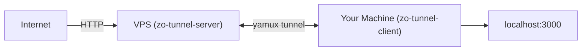
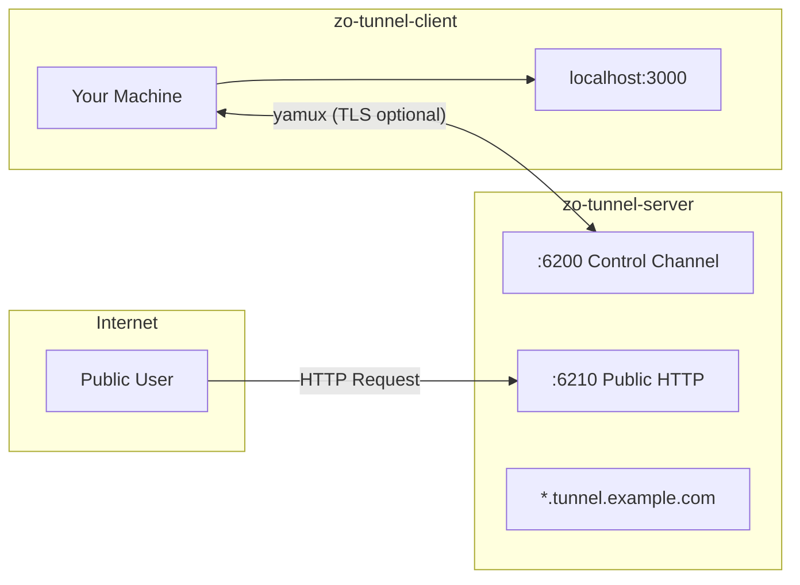
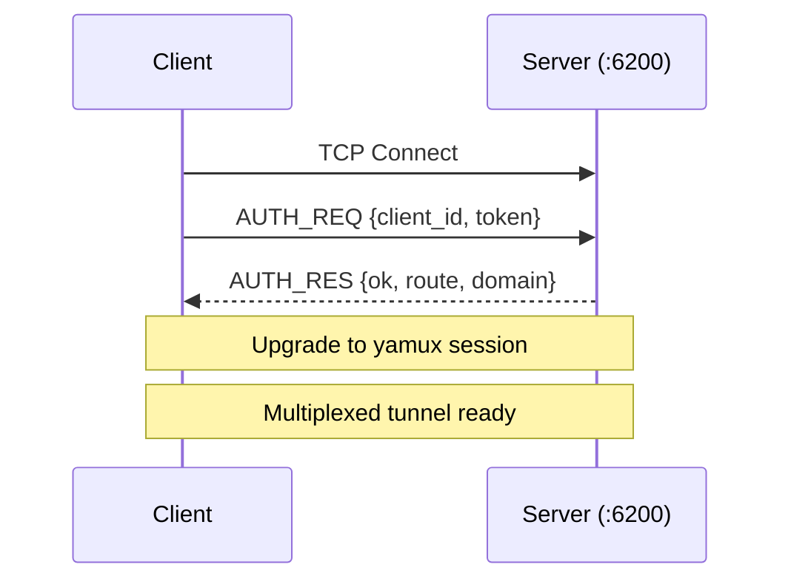

# Zo Tunnel

**Expose your local web apps and APIs to the internet through your own VPS — with subdomain routing, a management UI, and zero-config deployment.**

Zo Tunnel focuses on **HTTP tunneling for web apps and APIs** — nothing else. Fewer options, fewer decisions, simpler to use. Install, start, connect. That's it.

[](https://www.rust-lang.org/)
[](LICENSE)



---

## Features

- **Subdomain routing** — `myapp.tunnel.example.com` for each client
- **Token-based auth** — configurable list of valid tokens
- **Persistent credentials** — save once via web UI, auto-reconnect on launch
- **Yamux multiplexing** — multiple streams over a single TCP connection
- **Live dashboard** — real-time web UI at `dashboard.<domain>`
- **TLS control channel** — optional TLS for client-server communication
- **Rate limiting** — per-client request throttling
- **Auto-reconnect** — exponential backoff (1s to 30s)
- **Single static binary** — ~3.6MB server, ~2.9MB client
- **Web management UI** — manage tunnels from `http://127.0.0.1:16200`

---

## Architecture



| Port | Role |
|---|---|
| `:6200` | Control channel — client-server yamux session (optional TLS) |
| `:6210` | Public HTTP — subdomain routing and dashboard |

Each client is accessible at `<client_id>.<domain>`, dashboard at `dashboard.<domain>`.

---

## Quick Start

> [!IMPORTANT]
> **DNS must resolve to your server IP before starting the server.** The `--domain` flag is required and subdomain routing will not work until DNS is properly configured.

### 1. Configure DNS (do this first)

Add a wildcard A record pointing to your VPS:

```
*.tunnel.example.com  ->  YOUR_VPS_IP
  tunnel.example.com  ->  YOUR_VPS_IP
```

> [!TIP]
> Add a record for the root domain (`tunnel.example.com` — without `*`) as well. The wildcard only covers subdomains, not the root itself. The root record is needed for the dashboard and direct requests.

Verify that DNS has propagated:

```bash
dig +short myapp.tunnel.example.com
# Should return YOUR_VPS_IP
```

### 2. Install and start the server on your VPS

```bash
# Download pre-built binary
curl -sSL https://raw.githubusercontent.com/Zobite/zo-tunnel/main/scripts/install.sh | sudo bash -s server

# Start (first run creates config and installs systemd service automatically)
zo-tunnel-server start --domain tunnel.example.com
```

On first start, the server prints your **auth token** and a ready-to-use **client connect command**.

### 3. Install and start the client on your local machine

```bash
curl -sSL https://raw.githubusercontent.com/Zobite/zo-tunnel/main/scripts/install.sh | bash -s client

# Start the client (runs in background)
zo-tunnel-client start
```

The command prints the web UI URL and returns immediately. Open `http://127.0.0.1:16200` in your browser.

### 4. Connect via the Web UI

1. Enter your **server address** and **token** in the web UI
2. Click **Connect** — credentials are saved to `~/.zo-tunnel/`
3. Add tunnels: specify a **name** (used as subdomain) and a **local address** (e.g. `localhost:3000`)
4. Tunnels start automatically and will auto-reconnect on subsequent launches

Your tunnel is now accessible at `http://my-api.tunnel.example.com`.

---

## Traefik + SSL (Recommended)

For production deployments with HTTPS, place [Traefik](https://traefik.io/) in front of zo-tunnel's public port (`:6210`). Traefik handles SSL termination and auto-provisions Let's Encrypt certificates for each subdomain.

> [!IMPORTANT]
> **Prerequisite:** DNS must already resolve to your server IP (see [Step 1 above](#1-configure-dns-do-this-first)). Let's Encrypt certificate provisioning will fail if the domain does not resolve correctly.

### Step 1: Install Traefik

```bash
# Download Traefik binary
curl -sSL https://github.com/traefik/traefik/releases/latest/download/traefik_linux_amd64.tar.gz \
  | sudo tar xz -C /usr/local/bin traefik

sudo chmod +x /usr/local/bin/traefik
traefik version  # verify installation
```

### Step 2: Create configuration directories

```bash
sudo mkdir -p /etc/traefik/dynamic

# Create ACME storage for Let's Encrypt certificates
sudo touch /etc/traefik/acme.json
sudo chmod 600 /etc/traefik/acme.json
```

### Step 3: Create the Traefik static configuration

Create `/etc/traefik/traefik.yml`:

```yaml
# /etc/traefik/traefik.yml
entryPoints:
  web:
    address: ":80"
    http:
      redirections:
        entryPoint:
          to: websecure
          scheme: https
  websecure:
    address: ":443"

certificatesResolvers:
  letsencrypt:
    acme:
      email: your-email@example.com      # <-- Replace with your email
      storage: /etc/traefik/acme.json
      httpChallenge:
        entryPoint: web

providers:
  file:
    directory: /etc/traefik/dynamic
    watch: true                           # Required: auto-reload when zo-tunnel adds/removes config files

log:
  level: INFO
```

> [!WARNING]
> Replace `your-email@example.com` with a valid email address. Let's Encrypt uses this to send certificate expiration notices.

### Step 4: Create a systemd service for Traefik

```bash
sudo tee /etc/systemd/system/traefik.service > /dev/null <<'EOF'
[Unit]
Description=Traefik Reverse Proxy
After=network-online.target
Wants=network-online.target

[Service]
Type=simple
ExecStart=/usr/local/bin/traefik --configFile=/etc/traefik/traefik.yml
Restart=on-failure
RestartSec=5
LimitNOFILE=65536

[Install]
WantedBy=multi-user.target
EOF

sudo systemctl daemon-reload
sudo systemctl enable --now traefik
sudo systemctl status traefik
```

### Step 5: Start zo-tunnel-server

```bash
zo-tunnel-server start --domain tunnel.example.com
# Traefik detected: /etc/traefik/dynamic
```

Zo Tunnel **auto-detects** Traefik. If `/etc/traefik/dynamic` or `/etc/traefik/conf.d` exists on the server, integration is enabled automatically. No additional flags are required.

### How it works

When a client connects or disconnects, zo-tunnel automatically creates or removes Traefik dynamic configuration files:

```
Client connects with name "my-api"
  -> Server creates /etc/traefik/dynamic/zo-my-api.yml
  -> Traefik detects the new file (watch: true) and provisions a Let's Encrypt certificate
  -> https://my-api.tunnel.example.com is now live

Client disconnects
  -> Server removes /etc/traefik/dynamic/zo-my-api.yml
  -> Traefik removes the route automatically
```

### Verification

```bash
# Check that Traefik is running
sudo systemctl status traefik

# Verify SSL after a client connects
curl -I https://my-api.tunnel.example.com
# Should return HTTP 200 with a valid SSL certificate
```

> [!TIP]
> If you prefer Docker, you can also run Traefik as a container. Mount `/etc/traefik` into the container and ensure the `/etc/traefik/dynamic` directory is accessible to both the Traefik container and zo-tunnel-server on the host.

---

## CLI Reference

### Server

#### `zo-tunnel-server start`

Start the tunnel server. On first run, creates configuration and installs a systemd service automatically.
Subsequent runs load existing configuration and start or restart the service.

| Flag | Default | Description |
|---|---|---|
| `--domain` | *(required on first run)* | Base domain for subdomain routing |
| `--control-port` | `6200` | Client control channel port |
| `--public-port` | `6210` | Public HTTP port |
| `--token` | *(auto-generated)* | Client auth token |
| `--dashboard-token` | *(auto-generated)* | Dashboard admin token |
| `--force` | — | Overwrite existing config |
| `--foreground` | — | Run in foreground (for debugging or custom systemd units) |

#### `zo-tunnel-server stop`

Stop the systemd service.

#### `zo-tunnel-server restart`

Restart the systemd service.

#### `zo-tunnel-server status`

Display current configuration summary, service status, and token information.

#### `zo-tunnel-server logs`

View server logs via journalctl.

| Flag | Default | Description |
|---|---|---|
| `--lines` / `-l` | `50` | Number of recent log lines to show |
| `--follow` / `-f` | — | Follow log output in real-time |

#### `zo-tunnel-server upgrade`

Self-upgrade to the latest version from GitHub releases.

```bash
zo-tunnel-server upgrade
```

- Checks GitHub for the latest release
- Compares with the current version — skips if already up-to-date
- Downloads the correct binary for your OS and architecture
- Replaces the binary in `/usr/local/bin/` (uses `sudo` if needed)

> **Note:** Restart the service after upgrading: `zo-tunnel-server restart`

#### `zo-tunnel-server uninstall`

Remove the server binary, systemd service, and configuration.

```bash
zo-tunnel-server uninstall               # interactive confirmation
zo-tunnel-server uninstall --yes         # skip confirmation
zo-tunnel-server uninstall --keep-config # preserve /etc/zo-tunnel/
```

| Flag | Description |
|---|---|
| `--yes` / `-y` | Skip confirmation prompt |
| `--keep-config` | Keep config files, only remove binary and service |

---

### Client

The client runs as a **local web management UI**. All tunnel management (connect, add/remove tunnels, start/stop) is done through the browser at `http://127.0.0.1:16200`.

#### `zo-tunnel-client start`

Start the client web management UI as a background process. Prints the web URL and exits.
Logs are written to `~/.zo-tunnel/client.log`. PID is saved to `~/.zo-tunnel/client.pid`.

| Flag | Default | Description |
|---|---|---|
| `--port` | `16200` | Web UI port |
| `--bind` | `127.0.0.1` | Bind address for web UI |

If saved credentials exist (`~/.zo-tunnel/`), tunnels auto-start on launch.

#### `zo-tunnel-client stop`

Stop the running client process (sends SIGTERM for graceful shutdown).

#### `zo-tunnel-client status`

Show saved credentials and configured tunnels.

```bash
zo-tunnel-client status
```

#### `zo-tunnel-client upgrade`

Self-upgrade to the latest version from GitHub releases.

```bash
zo-tunnel-client upgrade
```

#### `zo-tunnel-client uninstall`

Remove the client binary and saved credentials.

```bash
zo-tunnel-client uninstall           # interactive confirmation
zo-tunnel-client uninstall --yes     # skip confirmation
```

---

## Configuration

Configuration is generated on the first `zo-tunnel-server start --domain ...` invocation and saved to `/etc/zo-tunnel/server.yaml`.

### Server

```yaml
control_port: 6200
public_port: 6210
domain: "tunnel.example.com"

auth:
  tokens:
    - "your-token"

dashboard_auth:
  token: "your-dashboard-token"
  session_ttl_secs: 86400

rate_limit:
  requests_per_second: 100
  max_connections_per_client: 50

# Traefik integration — auto-detected if /etc/traefik/dynamic or /etc/traefik/conf.d exists
traefik:
  enabled: false
  config_dir: "/etc/traefik/conf.d"
  entrypoint: "websecure"
  cert_resolver: "letsencrypt"

log_level: "info"
```

### Client

Client credentials are managed via the web UI at `http://127.0.0.1:16200`.

Credentials are saved to `~/.zo-tunnel/credentials.yaml`:

```yaml
server: "vps:6200"
token: "your-token"
tls:
  enabled: false
  server_name: ""
  skip_verify: false
```

Tunnels are saved to `~/.zo-tunnel/tunnels.yaml`:

```yaml
tunnels:
  - id: "abc123"
    client_id: "my-api"
    local_addr: "localhost:3000"
    enabled: true
  - id: "def456"
    client_id: "my-web"
    local_addr: "localhost:8080"
    enabled: true
```

---

## Protocol

### Handshake



### Binary frame format

```
+----------+----------+-----------+------------------+
| Version  |  Type    |  Length   |     Payload      |
| (1 byte) | (1 byte) | (4 bytes) |  (N bytes)       |
+----------+----------+-----------+------------------+
```

### Request flow


---

## Dashboard

Built-in web dashboard accessible at `dashboard.<domain>`:

- **Server status** — uptime, version
- **Connected clients** — list with connection duration
- **Live metrics** — requests, bytes transferred, active connections
- **Rate limit stats** — failed auth attempts, throttled requests

Auto-refreshes every 2 seconds.

| Endpoint | Description |
|---|---|
| `POST /api/login` | Authenticate with dashboard token |
| `GET /api/auth/check` | Check authentication status |
| `GET /api/status` | Server status and version |
| `GET /api/clients` | Connected tunnel clients |
| `GET /api/metrics` | Global traffic metrics |

Protected endpoints require authentication via session cookie (set by `/api/login`).

---

## TLS / SSL

For production HTTPS, use **Traefik** (or nginx) as a reverse proxy in front of zo-tunnel's public port (`:6210`). See the [Traefik + SSL](#traefik--ssl-recommended) section above.

The client supports TLS for the control channel (`:6200`) — configured via the web UI when connecting:

| Component | Encryption |
|---|---|
| Control channel (`:6200`) | Client TLS support (configured in web UI) |
| Public HTTP (`:6210`) | Use Traefik/nginx for SSL termination |

---

## Tech Stack

| Crate | Purpose |
|---|---|
| [tokio](https://tokio.rs/) | Async runtime |
| [yamux](https://docs.rs/yamux) | TCP multiplexing |
| [hyper](https://hyper.rs/) | HTTP/1.1 reverse proxy |
| [axum](https://docs.rs/axum) | Dashboard REST API |
| [tokio-rustls](https://docs.rs/tokio-rustls) | TLS support |
| [clap](https://docs.rs/clap) | CLI with subcommands |
| [serde](https://serde.rs/) + serde_yaml | Config serialization |
| [dashmap](https://docs.rs/dashmap) | Concurrent client registry |
| [tracing](https://docs.rs/tracing) | Structured async logging |

---

## Build from source

```bash
git clone https://github.com/Zobite/zo-tunnel.git && cd zo-tunnel
cargo build --release
# -> target/release/zo-tunnel-server
# -> target/release/zo-tunnel-client
```

## Testing

```bash
cargo test --workspace                              # Unit tests
cargo build --release && bash scripts/e2e_test.sh   # End-to-end
```

---

## Contributing

Contributions are welcome. See [CONTRIBUTING.md](CONTRIBUTING.md) for guidelines.

## License

MIT — see [LICENSE](LICENSE) for details.
